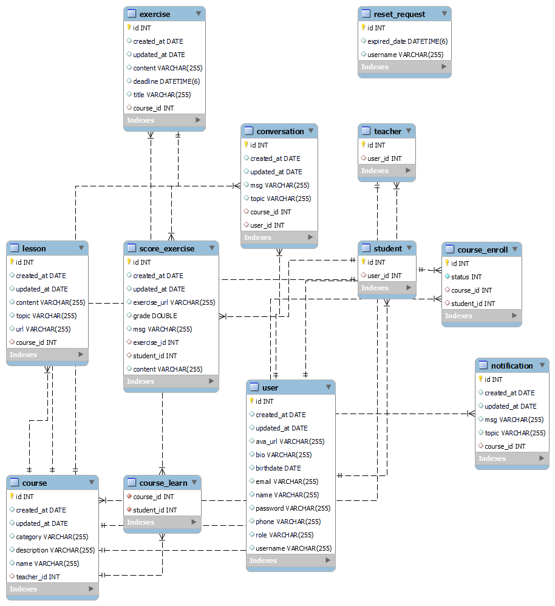

# Lược đồ cơ sở dữ liệu

## ER Diagram

   
  
  
 

## Các chức năng

### Dùng chung

- Đăng ký
  - Đăng ký tài khoản người dùng mới theo 2 loại người dùng: Học viên/Giáo viên
  - Email và Username là độc nhất
- Đăng nhập
  - Tìm kiếm tài khoản, kiểm tra loại người dùng, cho phép truy cập các trang được phép
- Sửa thông tin tài khoản

  - Sửa đổi các thông tin cá nhân, ảnh đại diện
  - Đổi mật khẩu

- Tìm kiếm / hiển thị / truy cập khóa học

  - Tìm kiếm dựa theo tên khóa học
  - Lấy ra các thông tin khóa học
    - Tên
    - Giảng viên
    - Các bài giảng / tài liệu / bài kiểm tra
    - Xem thông báo của khóa học
    - Xem / viết trên diễn đàn của khóa học

- Xem thông tin người dùng
  - Hiển thị các thông tin chung của người dùng khác

 
 
  
### Riêng cho từng kiểu người dùng

#### Giáo viên:

- Tạo, sửa, xóa, quản lý khóa học:
  - Tạo khóa học
  - Thêm bài học
  - Thêm bài kiểm tra, thêm bài tập
  - Tạo / xóa thông báo
  - Thêm học sinh vào khóa học, chấp nhận yêu cầu tham gia của học viên
  - Xóa học sinh ra khỏi khóa học
  - Thống kê điểm của học sinh

#### Học viên:

- Tham gia khóa học:
  - Gửi yêu cầu tham gia khóa
  - Làm bài kiểm tra, làm bài tập
  - Xem điểm thống kê của bản thân
  - Rời khỏi khóa học

## Các thực thể

- Teacher
- Student
- Course
- Exam
- Exercise
- Lesson
- Notification
- Conversation
